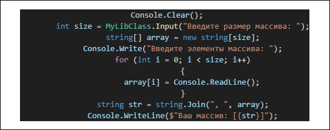
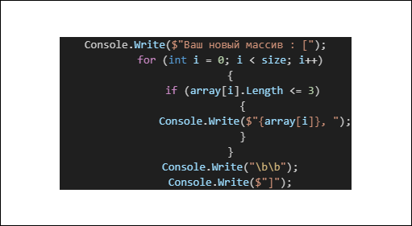
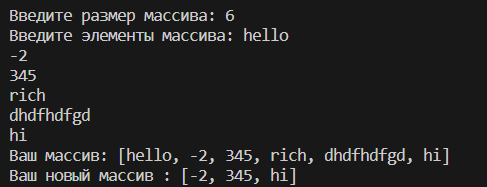

# ***Текстовое описание решения:***

## **Создание массива:**
1. Для начала указываем размер будущего массива, путем создавани переменной __size__ типа __int__ и делаем так, чтобы пользователь сам задавал размер, который ему необходим.
2. После чего нужно создать ячейку памяти для будущего массива, путем его инициализации с типом __string__ (string[] array).
3. Далее создаем программу для запонения нашего массива, через цикл **for**, так чтобы пользователь мог сам вводить нужные ему элементы массива.
4. Создаем переменную типа __string__ для корректного отображения массива на одной строке, с помощью оператора __Join__.
5. Выводим наш готовый массив в консоль. 

## **Добавление условий для массива:**
1. С помощью цикла __for__ снова проходим по нашему массиву.
2. Внутри цикла создаем условие, с помощью оператора __if__, в котором указываем что длина каждого элемента массива не должна быть больше **3**.
3. Выводим наш массив только с теми элементами, которые удовлетворяют нашему условию. 

## **Проверка программы:**
    Проверем как работает наша программа!

